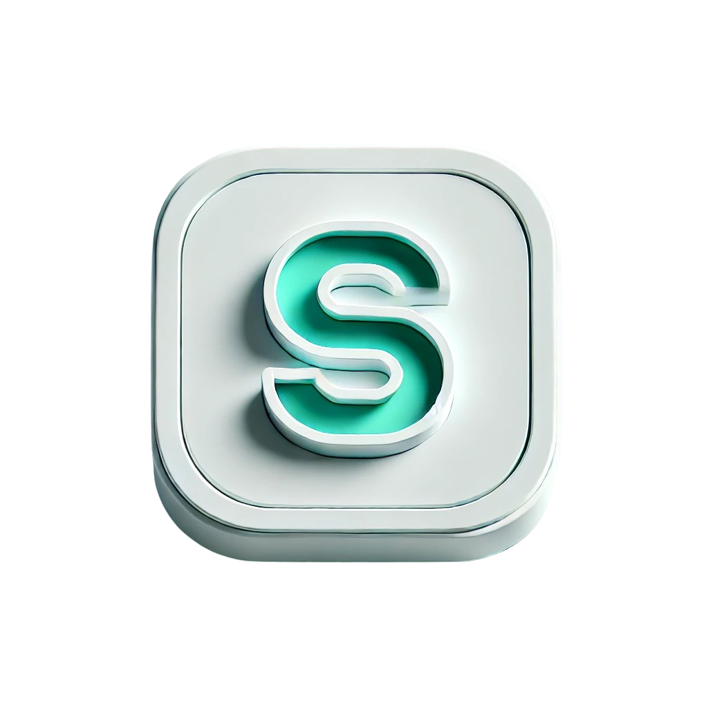

  
  <h1>João Victor Secundo </h1>

  

🎯 **Desenvolvedor dedicado por tecnologia**, com foco em **Flutter**, **Python**, **Node.js** e **soluções em DevOps**.  
🚀 Sempre em busca de aprender e criar projetos que impactem positivamente o mundo.  
⚡ Explorando o universo de **IA, Automação, Desenvolvimento Mobile e Machine Learning**.  

---

## 🚀 Tecnologias que mais utilizo

  

---

## 💼 Tecnologias e Ferramentas

  <a href="https://flutter.dev" target="_blank" style="text-decoration: none; text-align: center; margin: 5px;">
    
    
Flutter

  </a>
  <a href="https://dart.dev" target="_blank" style="text-decoration: none; text-align: center; margin: 5px;">
    
    
Dart

  </a>
  <a href="https://www.python.org" target="_blank" style="text-decoration: none; text-align: center; margin: 5px;">
    
    
Python

  </a>
  <a href="https://nodejs.org" target="_blank" style="text-decoration: none; text-align: center; margin: 5px;">
    
    
Node.js

  </a>
  <a href="https://developer.mozilla.org/en-US/docs/Web/JavaScript" target="_blank" style="text-decoration: none; text-align: center; margin: 5px;">
    
    
JavaScript

  </a>
  <a href="https://developer.mozilla.org/en-US/docs/Web/HTML" target="_blank" style="text-decoration: none; text-align: center; margin: 5px;">
    
    
HTML

  </a>
  <a href="https://developer.mozilla.org/en-US/docs/Web/CSS" target="_blank" style="text-decoration: none; text-align: center; margin: 5px;">
    
    
CSS

  </a>
  <a href="https://www.docker.com" target="_blank" style="text-decoration: none; text-align: center; margin: 5px;">
    
    
Docker

  </a>
  <a href="https://github.com" target="_blank" style="text-decoration: none; text-align: center; margin: 5px;">
    
    
GitHub

  </a>

---

## 💻 Bancos de Dados

  <a href="https://www.mysql.com" target="_blank" style="text-decoration: none; text-align: center; margin: 5px;">
    
    
MySQL

  </a>
  <a href="https://www.postgresql.org" target="_blank" style="text-decoration: none; text-align: center; margin: 5px;">
    
    
PostgreSQL

  </a>
  <a href="https://www.mongodb.com" target="_blank" style="text-decoration: none; text-align: center; margin: 5px;">
    
    
MongoDB

  </a>
  <a href="https://www.sqlite.org" target="_blank" style="text-decoration: none; text-align: center; margin: 5px;">
    
    
SQLite

  </a>

---

## 🔥 Status do GitHub

  

---

## 🌐 Contribuições Recentes

  

---

## 👀 Contador de Visitas

  

    
    
  

---

## ⚡ Últimos Projetos

  <a href="https://github.com/JVSecundo/hospital_app" style="text-decoration: none;">
    

      
      

        <h3 style="color: #00A859; margin: 0; font-size: 20px;">Saúde Sem Espera</h3>
        
Sistema inteligente de gerenciamento de filas hospitalares

      

    

  </a>
  <a href="https://github.com/JVSecundo/docker-automation" style="text-decoration: none;">
    

      
      

        <h3 style="color: #2496ED; margin: 0; font-size: 20px;">Automação com Docker</h3>
        
Scripts para automação de ambientes com Docker e Vagrant

      

    

  </a>
  <a href="https://github.com/JVSecundo/ecoterapia-project" style="text-decoration: none;">
    

      
      

        <h3 style="color: #00A859; margin: 0; font-size: 20px;">Site de Ecoterapia</h3>
        
Plataforma web para gestão de sessões de ecoterapia

      

    

  </a>

---

## 📫 Vamos nos conectar?

  <a href="https://www.linkedin.com/in/joão-victor-secundo-santos-515633237" target="_blank" style="text-decoration: none; text-align: center; margin: 5px;">
    

      
    

    
LinkedIn

  </a>
  <a href="https://github.com/JVSecundo" target="_blank" style="text-decoration: none; text-align: center; margin: 5px;">
    

      
    

    
GitHub

  </a>
  <a href="mailto:joaovictorsecundo402@gmail.com" target="_blank" style="text-decoration: none; text-align: center; margin: 5px;">
    

      
    

    
E-mail

  </a>
  <a href="https://w.app/45bthz" target="_blank" style="text-decoration: none; text-align: center; margin: 5px;">
    

      
    

    
WhatsApp

  </a>

---

